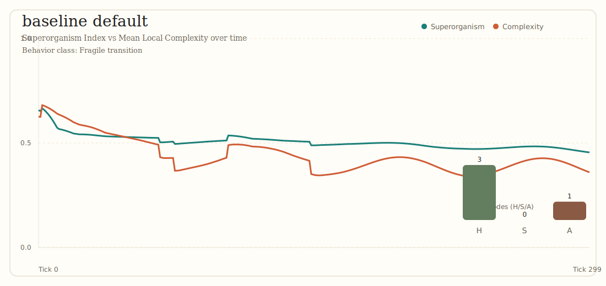
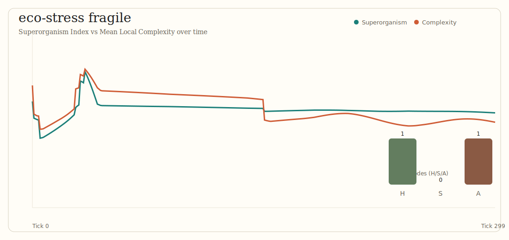
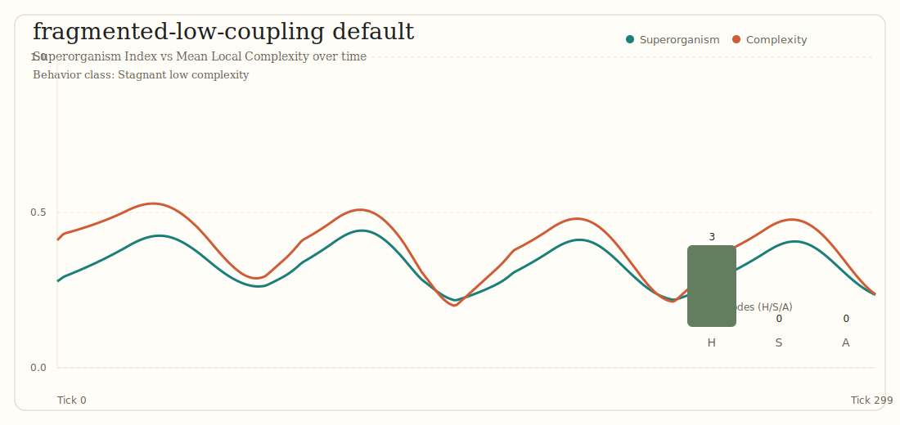

# Walrus Simulator

Open-source simulation framework to test explicit assumptions about energy, materials, institutions, and emergent superorganism dynamics.
Current modeling objective: capture how behavior shifts with group size and historical transitions from hunter-gatherer to sedentary to agricultural societies.

## Tech Direction

- Engine core: Rust (performance, safety, scalability)
- Analysis/orchestration: optional Python layer later (via `uv`)

## Quality Gates

- Format: `cargo fmt --all -- --check`
- Lint: `cargo clippy --workspace --all-targets -- -D warnings`
- Tests: `cargo test --workspace --all-targets`
- Coverage (core engine): `cargo llvm-cov --package walrus-engine --all-targets --fail-under-lines 90 --summary-only`
- Coverage (workspace): `cargo llvm-cov --workspace --all-targets --fail-under-lines 80 --summary-only`

## Quick Start

```bash
cargo fmt --all
cargo clippy --workspace --all-targets -- -D warnings
cargo test --workspace --all-targets
cargo llvm-cov --package walrus-engine --all-targets --fail-under-lines 90 --summary-only
cargo llvm-cov --workspace --all-targets --fail-under-lines 80 --summary-only
```

## Run Emergence Example

```bash
cargo run -p walrus-engine --example emergence_run
```

## Run Scenario Sweep

```bash
cargo run -p walrus-engine --example sweep_scenarios
```

## Generate Public-Friendly Report

```bash
make viz-report
```

This writes:

- `outputs/latest/report.md` (calibration + uncertainty summary)

## Generate Standalone Viewer

```bash
make viz-app
```

This writes a self-contained interactive dashboard with uncertainty bands,
event annotations, and a driver-explanation panel:

- `outputs/latest/app/index.html`

Benchmark anchor used by report/viewer:

- `data/benchmarks/owid_maddison_anchor.csv`

## Run Agent-Life TUI

```bash
make tui-life
```

This launches a live terminal simulation where each character is an agent and
emergence is shown frame-by-frame.

## Run Evolutionary Actor Map

```bash
make evolution-run
```

This runs multi-generation actor evolution with:

- Dunbar-scale social transitions,
- NK fitness + mutation over generations,
- continent-level energy/resource constraints,
- local emergence and collapse cycles.

## Run Isolation Sweep

```bash
make evolution-sweep
```

This compares abstract continent layouts and isolation levels to study:

- convergent evolution (shared adaptation trajectories),
- divergence/adaptation to local realities,
- collapse frequency under constrained diffusion.

## Exploration Snapshots

Generated from real scenario outputs (`make viz-report` + `node scripts/generate_snapshots.mjs`):





## System Feedback Loop

```bash
make system-feedback
```

## Agent/Actor Simulation

The engine supports explicit micro-agent interaction loops
(cooperation/trade/conflict/migration + memory + demographic turnover)
that roll up into macro emergence metrics.

It also includes a society-level actor model with per-generation messages,
geography constraints, and evolutionary adaptation.

Usage guidance is documented in:

- `docs/foundations/09_agent-actor-simulation.md`
